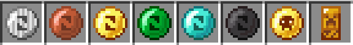

# SimpleCoin

SimpleCoin is a light, item-based currency mod for SMPs and modpacks, with banking features.

---

## Features

- 8 coin types:
  - Gold Coin
  - Copper Coin
  - Diamond Coin
  - Emerald Coin
  - Iron Coin
  - Netherite Coin
  - Golden Blood Coin
  - Credit
- Persistent banking system — balances are saved to disk and survive server restarts.
- Commands:
  - `/deposit <coin|all> <amount|all>`
  - `/withdraw <coin|all> <amount|all>`
  - `/balance`
  - `/transfer <target> <coin|all> <amount|all>`

---

## Items Preview

---

## Crafting Recipes

Each coin is crafted with **1 block of its material in the center** and **4 ingots (or gems) around it**.

---

## License

MIT License © 2025 Amir Torabi
